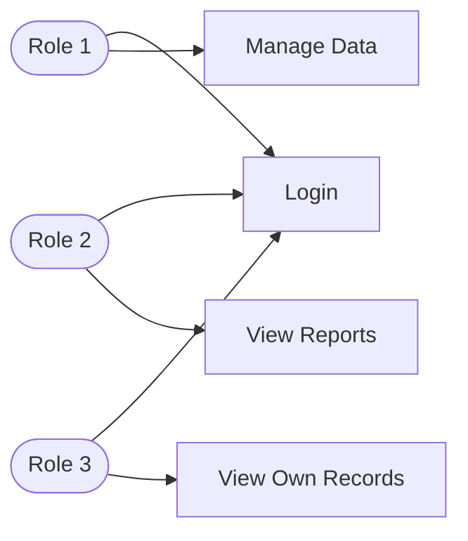

# Project Proposal: PHP + MySQL Application

> **Course:** J620-002-4:2020 Front-End Software Development (Level 4)
> **Competency Unit:** J620-002-4:2020-C01
> **Instructions:** Replace every `[ ... ]` and delete the hint lines (starting with `>`) before submitting. Keep this file as `README.md` in the root of your project repository.

---

## 1. Student Details

| Field | Your Answer |
|---|---|
| Candidate Name | [ Matthew Tan Khai Jin ] |
| NRIC Number | [ 080603-07-0247 ] |
| Date Submitted | [  ] |

---

## 2. Project Title

**[ Course Enrollment System ]**

### One-line summary
[ Describe what your application does in one sentence. ]
Students enroll in classes, tutors manage class content and attendance, admin manages tutors and classes
---

## 3. Problem Statement & Purpose

> What problem does your application solve? Who is it for? Why is it useful?

[ Many small tuition centres and private academies still manage class enrollment, attendance, and paper registers, or WhatsApp messages.Students don't have a clear way to see what classes are available or track their own enrollment status, tutors struggle to keep accurate attendance records across multiple classes, and admins spend excessive time manually cross-checking, who is enrolled, and which classes are full. ]

---

## 4. Tech Stack

> Required: HTML, CSS, PHP, MySQL.

| Layer | Technology |
|---|---|
| Markup | HTML5 |
| Styling | CSS3 |
| Server-side | PHP |
| Database | MySQL |

---

## 5. Types of Users (Roles)

> Minimum **3 roles**. Each role must have different levels of access.

| Role | Description |
|---|---|
| [ Role 1, e.g. Admin ] | [ Manages the overall system — creates and manages courses, assigns tutors, oversees all enrollments , and views system-wide reports. ] |
| [ Role 2, e.g. Tutor ] | [ Teaching staff who view the courses assigned to them, see their list of enrolled students, and mark attendance for each session. ] |
| [ Role 3, e.g. Student ] | [ Learners who browse the course catalog, self-enroll (or withdraw) from courses, and view their own enrollment history, attendance, and payment status. ] |

### Role-Based Access Matrix

> Mark what each role can do. Add or remove rows to match your features.

| Feature / Page | Admin | Tutor | Student | Guest (not logged in) |
|---|:---:|:---:|:---:|:---:|
| Register / Login | ✅ | ✅ | ✅ | ✅ |
| [ View course catalog ] | ✅ | ✅ | ✅ | ✅ (read-only) |
| [ Manage tutor accounts ] | ✅ | ❌ | ❌ | ❌ |
| [ Create / edit / delete courses ] | ✅ | ❌ | ❌ | ❌ |

---

## 6. Features

### 6.1 Core Features (must have)

- [ ] User registration and login
- [ ] Role-based access control (each role sees/does different things)
- [ ] Data management (Create, Read, Update, Delete)
- [ ] Course enrollment with seat-limit checking (students cannot enroll in a full class, and cannot enroll twice in the same course)
- [ ] Attendance tracking (tutors mark Present/Absent/Late per session; students can view their own attendance history)

### 6.2 Extra Features (nice to have)

- [ ] [ Your feature ]
- [ ] [ Your feature ]

### 6.3 Feature Descriptions

> Briefly explain each core feature: what it does and which role uses it.

| Feature | Description | Role(s) |
|---|---|---|
| [ User registration and login ] | [ User registration or login with a name, email, password ] | [ Admin, Tutor, Student ] |
| [ Data management (CRUD) ] | [ Can create, view, edit, and delete courses — setting the title, subject, schedule, assigned tutor, and max seats.] | [ Admin ] |

---

## 7. Data Management System

> Which data can users create, view, edit and delete? Who is allowed to do what?

| Data / Entity | Create | Read | Update | Delete |
|---|---|---|---|---|
| Users (accounts)  | [ Student, Tutor (self, via registration) ] | [ Admin (all), each user (own profile) ] | [ Admin (all), each user (own profile) ] | [ Admin ] |
| Course  | [ Admin ] | [  Admin, Tutor, Student, Guest ] | [ Admin ] | [ Admin ] |

---

## 8. Database Design

> Minimum **4 tables** with at least **3 linkages** (foreign keys) between them.

### Entity Relationship Diagram (ERD)

> Create your own ERD for your database and place it here. You can draw it in draw.io or dbdiagram.io and insert the exported image (e.g. ``), or write it in Mermaid.

[ Insert your ERD here ]

---

## 9. Use Case Diagram

> Show the actors (roles) and what each can do in the system. Use a Mermaid flowchart below, or export an image from draw.io / Lucidchart to `docs/usecase.png`.

---

## 10. Presentation Checklist

- [ ] Can explain the purpose of the application
- [ ] Can justify design choices (why this database structure, why these roles)
- [ ] Can demo every role
- [ ] Can answer questions about my own code
- [ ] Submitted on time
